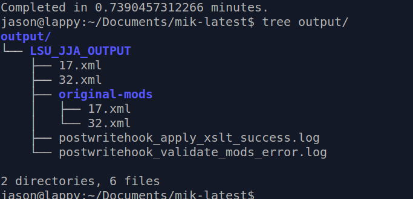
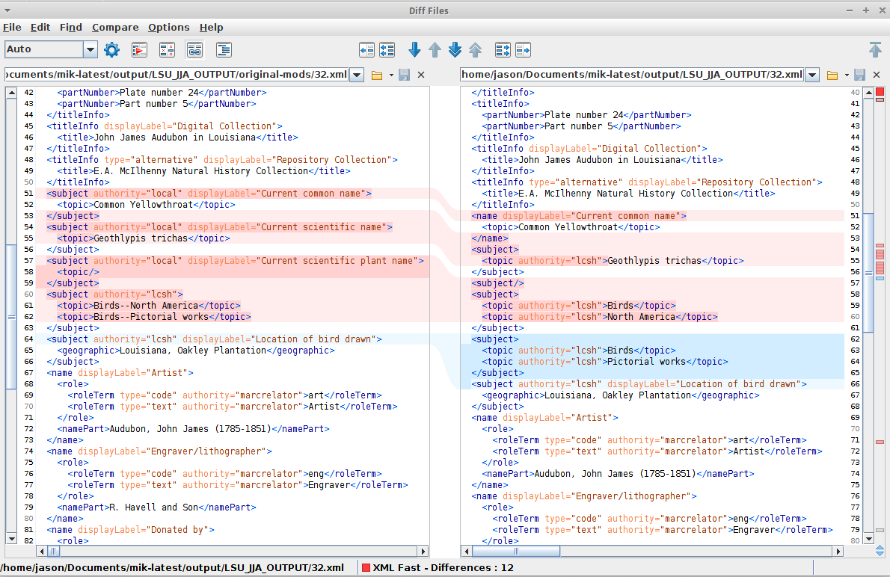
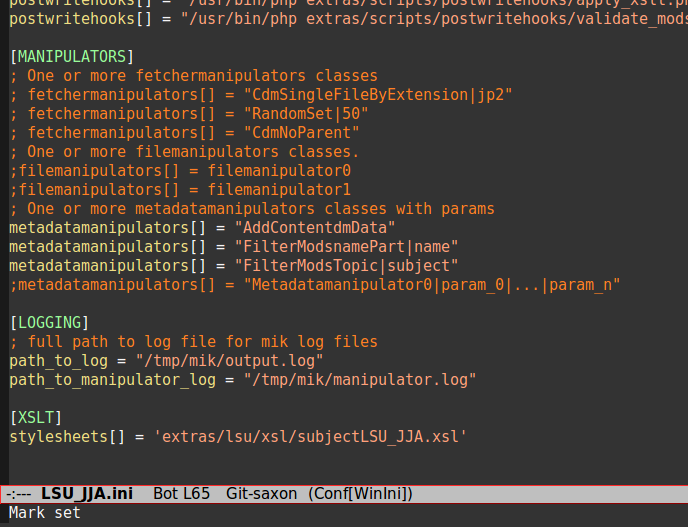

### MIK: Saxon branch

#### Scenario

Using the `saxon` branch of [lsulibraries/mik](https://github.com/lsulibraries/mik/tree/saxon), at commit [9c47c9f80](https://github.com/lsulibraries/mik/commit/9c47c9f8017b22066856ccba50c5575e2eeb29af), we use the command line: 

`./mik --config=extras/lsu/configuration_files/LSU_JJA.ini --limit=2`. 

The resulting `output/` directory should look like this:

The log file shows the saxon command lines that have been run (output elided, and spaces included for legibility):

~~~

jason@lappy:~/Documents/mik-latest$ cat output/LSU_JJA_OUTPUT/postwritehook_apply_xslt_success.log 

[2016-04-19 22:37:29] postwritehooks/apply_xslt.php.INFO: Beginning xslt transformations for output/LSU_JJA_OUTPUT/17.xml [] []
[2016-04-19 22:37:29] postwritehooks/apply_xslt.php.INFO: Applying stylesheet extras/lsu/xsl/subjectLSU_JJA.xsl [] []

[2016-04-19 22:37:29] postwritehooks/apply_xslt.php.INFO: Saxon command line: java -jar saxon9he.jar -s:output/LSU_JJA_OUTPUT/17.xml -xsl:extras/lsu/xsl/subjectLSU_JJA.xsl  -o:output/LSU_JJA_OUTPUT/17.xml [] []

[2016-04-19 22:37:48] postwritehooks/apply_xslt.php.INFO: Beginning xslt transformations for output/LSU_JJA_OUTPUT/32.xml [] []
[2016-04-19 22:37:48] postwritehooks/apply_xslt.php.INFO: Applying stylesheet extras/lsu/xsl/subjectLSU_JJA.xsl [] []

[2016-04-19 22:37:48] postwritehooks/apply_xslt.php.INFO: Saxon command line: java -jar saxon9he.jar -s:output/LSU_JJA_OUTPUT/32.xml -xsl:extras/lsu/xsl/subjectLSU_JJA.xsl  -o:output/LSU_JJA_OUTPUT/32.xml [] []

~~~

#### One Comparison

Focusing on the item with key 32 for this test; checksum of the files reveals a difference:

~~~

jason@lappy:~/Documents/mik-latest$ sha1sum output/LSU_JJA_OUTPUT/original-mods/32.xml
abadc92641f88bc11131b22a9f189459d84cfd9f  output/LSU_JJA_OUTPUT/original-mods/32.xml
jason@lappy:~/Documents/mik-latest$ 
jason@lappy:~/Documents/mik-latest$ sha1sum output/LSU_JJA_OUTPUT/32.xml
e1af4ca76ba16216328314f4e41c73b5a69da7ed  output/LSU_JJA_OUTPUT/32.xml

~~~

Note that files in the `original-mods` directory are the vanilla output of mik, as configured with the file given in the command line (minus the XSLT section).

Opening in oxygen, running a diff, the effect of the transform is clear:

Add additional stylesheets to the ini following this example:

### To reproduce:

* ensure that Java is installed and available from your PATH
    * you can test this on the command line:
	
~~~

    jason@lappy:~/Documents/test$ java -version
    java version "1.7.0_95"
    OpenJDK Runtime Environment (IcedTea 2.6.4) (7u95-2.6.4-0ubuntu0.14.04.2)
    OpenJDK 64-Bit Server VM (build 24.95-b01, mixed mode)

~~~

* `git clone https://github.com/lsulibraries/mik`
* `cd mik`
* `git checkout 9c47c9f80`
* `composer install` # assumes that composer is installed and in your PATH
* `sha1sum output/LSU_JJA_OUTPUT/original-mods/32.xml && sha1sum output/LSU_JJA_OUTPUT/32.xml`
    * you may find that your sha1sum is different from that listed here; our mik pull from cdm includes 'date retrieved' information in the <extension> element (the original cdm metadata).
	
	
* Compare in oxygen
    * Open the files in oxygen 
    * from the menu, choose `Tools` > `Compare files`, selecting the two files you've just opened

### Unanswered Questions - further investigations...

* While adding the xslt step to mik, it seemed as though namespace incongruities between xml and xslt were:
    * causing saxon to issue warnings about namespace
    * preventing xslt from matching anything
 
